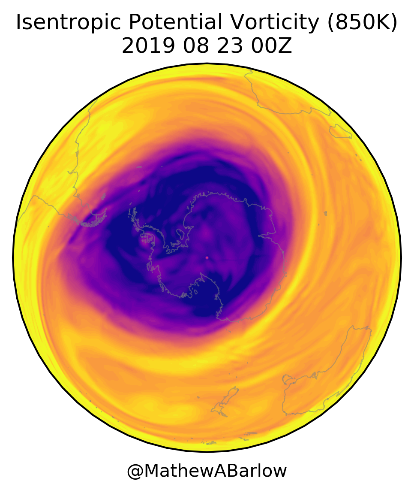

# stratospheric-polar-vortex
This repository contains python code related to plotting and analyzing the stratospheric polar vortex in either the Northern or Southern Hemisphere.

Currently there is one program, spv_sh_cfsv2.py, to make an animation of the Southern Hemisphere Stratospheric Polar Vortex, in terms of 850K isentropic potential vorticity. Uses CFSv2 isentropic data from the NOMADS server.  The output is a bunch of png plots that I separately use Imagemagick to convert into a GIF animation. Coded in Python by a Fortran thinker without comments, so ... sorry!

If you have any questions or comments, please contact me at: Mathew_Barlow@uml.edu

Sample frame:

animation:

Acknowledgements

Support from NSF AGS-1623912 and NSF AGS-1657921 is gratefully acknowledged.

